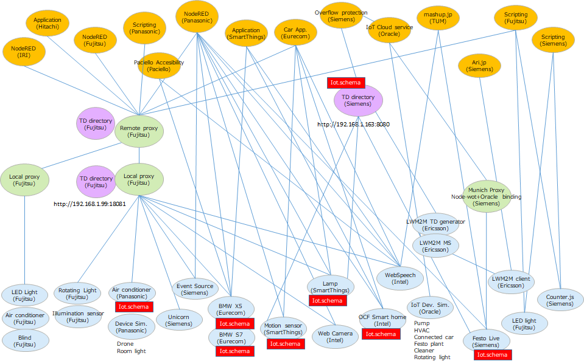
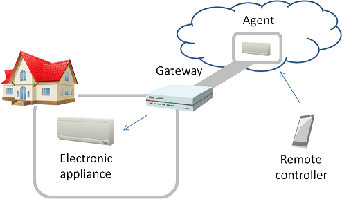
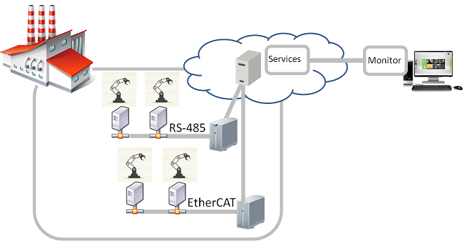
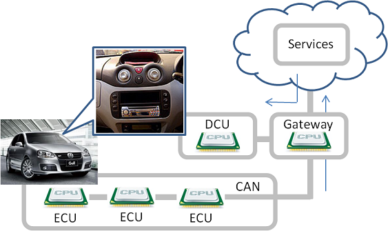
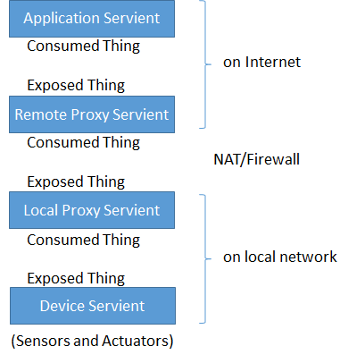
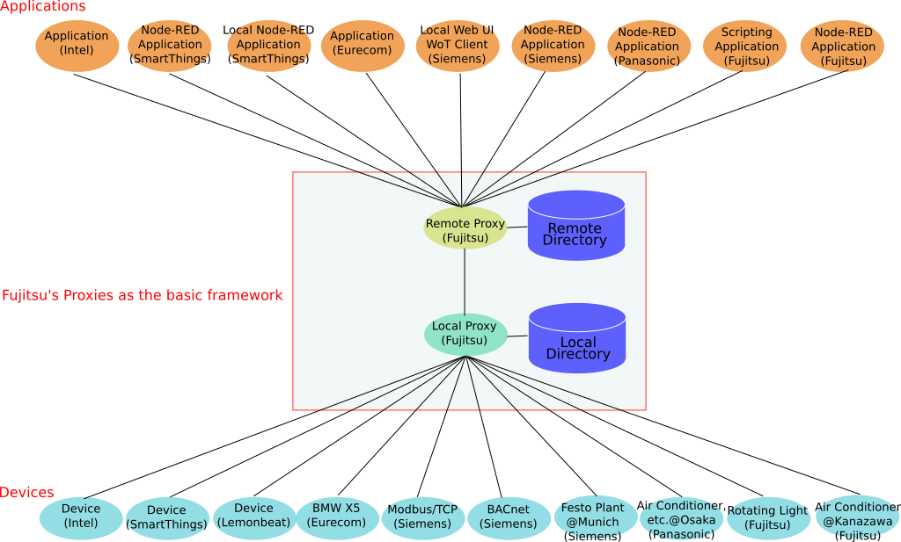

# PlugFest Preparation for Korea F2F 2018

# 1. Introduction

This document describes a general information related to the next plugfest in Prague F2F meeting. 

## 1.1 Backgroud

In the past plugfest, we've already checked consistency of the interfaces of two Servients provided by different members. They were combinations of application and device, or device to device. These application and devices were compatible to rWoT and talked with it. To setup a larger scale system, the gateawy functions are required to connect multiple applications and devices located on the different places. We'd introduced proxy Servients in the Burlingame plugfest to archieve this purpose. As a result of this, a variety of devices settled in some cases could be connected from the application running both on the cloud and on the local controlers.
The figure below shows the diagram of all the Serviente connected to the network of the plugfest. 8 companies brought applications, remote proxies, local proxies and devices as WoT Serivients or protocol converters with legacy devicee, such as home appliances, building facilities, factory facilities and vihcles.



## 1.2 Use case

Some use cases are described in below but not limited to the followings.

(1) Smart home
This is the smarthome application that the application on the smartphone can control the air conditioner in the house. The agent and the gateway have gateway functions that connects with applications, devices, and gateways.



(2) Smart factory



(3) Connected car



# 2. Servients

All servients should register their TDs to a central Thing Directory for discovery purposes.
Thingweb's Directory should be used for this purpose. To register a TD, send:
```
POST http://plugfest.thingweb.io:8081/td
Content-Type: application/ld+json
Body: {... your TD ...}
```

to which the server should reply with the location of the created resource for your TD (`http://plugfest.thingweb.io:8081/td/{your-handle}`):
```
201 Created
Location: /td/{your-handle}
```

A GUI is also available at http://plugfest.thingweb.io:8081/ to manually register TDs (_no error reporting yet_).

## 2.1 4-layered Servients

3 types of WoT Servients was derived from the use case described in 1.2. These are defined below:  
* Device Servient: WoT Servient with Exposed Thing, e.g. devices
* Application Servient: WoT Servient with Consumed Thing, e.g. applications
* Proxy Servient: WoT Servient with both Exposed and Consumed Thing, e.g. gateways

The Proxy Servient are seperated to 2 types fo them, Remote Proxy and Local Proxy. The Remote Proxy Servient is deployed on the Internet and connected with the Applicationd Serivent and the Local Proxy Servient. The Local Proxy Servient is done on the Local network and connects with the Remote Proxy Servient and the Device Servient. The layered diagram is shown below.



## 2.2 Servients and Protocols
Notes: The following contents has been just copied from Barlingame table. Please modify below directly.

<table>
  <tr>
    <th>Servients</th>
    <th colspan="2">Fujitsu</th>
    <th colspan="2">Panasonic</th>
    <th>Internet Reserach Institute</th>
    <th colspan="2">Siemens</th>
    <th>Lemonbeat</th>
    <th colspan="2">Intel</th>
    <th colspan="2">SmartThings</th>
    <th>EURECOM</th>
  </tr>
  <tr>
    <td>Application</td>
    <td>Scripting App.</td>
    <td>NodeRED</td>
    <td>Scripting App.</td>
    <td>NodeRED</td>
    <td>NodeRED</td>
    <td>Scripting App.</td>
    <td>WebUI</td>
    <td></td>
    <td>AWS WoT Skill</td>
    <td>AlexNet Recog Service</td>
    <td>NodeRED Local</td>
    <td>NodeRED Remote</td>
    <td></td>
  </tr>
  <tr>
    <td>=protocol</td>
    <td>HTTP</td>
    <td>HTTP(s)</td>
    <td colspan="2"></td>
    <td>HTTP(s)</td>
    <td>HTTP, CoAP, BACnet, Modbus</td>
    <td>HTTP, CoAP</td>
    <td></td>
    <td colspan="2">HTTPS</td>
    <td colspan="2">HTTP</td>
    <td></td>
  </tr>
  <tr>
    <td>Remote Proxy</td>
    <td colspan="2">Fujitsu Cloud</td>
    <td colspan="2"></td>
    <td></td>
    <td colspan="2">WoS Messaging Service</td>
    <td></td>
    <td colspan="2">Cloud proxy shadow</td>
    <td colspan="2">Remote Gateway</td>
    <td></td>
  </tr>
  <tr>
    <td>=protocol</td>
    <td colspan="2">HTTP(s)+WS</td>
    <td colspan="2"></td>
    <td></td>
    <td colspan="2">(tunnel)</td>
    <td></td>
    <td colspan="2">HTTPS/CoAP(s)</td>
    <td colspan="2">HTTP + MQTT</td>
    <td></td>
  </tr>
  <tr>
    <td>Local Proxy</td>
    <td>Local Gateway</td>
    <td>Local Gateway</td>
    <td colspan="2"></td>
    <td></td>
    <td colspan="2">WoS Messaging Service, TD Registration Agent</td>
    <td></td>
    <td colspan="2">Local Proxy</td>
    <td colspan="2">Local gateway</td>
    <td></td>
  </tr>
  <tr>
    <td>=Protocol</td>
    <td>HTTP</td>
    <td>HTTP</td>
    <td>HTTPS (+ WSS)</td>
    <td>HTTP</td>
    <td></td>
    <td colspan="2">HTTP</td>
    <td>HTTP</td>
    <td colspan="2">CoAP</td>
    <td colspan="2">HTTP + MQTT</td>
    <td>HTTP</td>
  </tr>
  <tr>
    <td>Device</td>
    <td>Sensors(Luminance sensor, Humidity sensor, Temperature sensor, Accelerometer), Rotating Light</td>
    <td>Air conditioner, LED light, Blind</td>
    <td>LED light, Air conditioner (home/car), Robot Cleaner, Amazon Echo Dot, Google Home mini</td>
    <td>WoT Simulator, Google Home mini</td>
    <td></td>
    <td colspan="2">Remote Festo Plant (valve, pump, levelmeter), BACnet Demonstrator, Logo! Demonstrator, RGB LED Light</td>
    <td>Sensors(Luminance sensor, Humidity sensor, Temperature sensor), Binary actuator</td>
    <td colspan="2">OCF RGB light, OCF Light, OCF Buzzer, OCF temperture, OCF Button, OCF Proximity, OCF Slider, Still camera</td>
    <td colspan="2">Dimmable Light(ST), Motion Sensor(IPSO), Loudness Sensor(IPSO), Illuminance Sensor(IPSO),
    <td>Sensors and Actuators in the car(BMW X5)</td>
  </tr>
</table>


## 2.3 Servients from plugfest participants ( diagram )



## 2.4 Details of Servients

### 2.4.1 Application Servients

Panasonic:
 - Scripting App.: Panasonic demo applications. (Local/Internet+LAN/HTTPS(+WSS))
 - NodeRED: would like to connect to the all servients. (Local/Internet+LAN/HTTPS(+WSS))

Hitachi: (not yet fully implemented)
 - Collect data from Things via Remote Proxy Servient(s) and visualize its data.
   - NodeRED
   - Logstash + Elasticsearch + Kibana

### 2.4.2 Remote Proxy Servients
### 2.4.3 Local Proxy Servients

Fujitsu:
 Remote/Local proxy Servients provide the following functions
 - Thing directory
 - Registry and discovery opeartions
 - Read and Write properties operations
 - Event operation

 See Appendix for the sequence diagrams and the interfaces between applications/devices and proxies.

### 2.4.4 Device Servients

#### Panasonic
 - [LED light](TDs/PanasonicTDs/huegroup-p1.jsonld): on/off, RGB properties (Remote/Internet/HTTPS)
 - [Air conditioner home](TDs/PanasonicTDs/air-conditioner-p1.jsonld): on/off, mode, temperature, wind level properties and events (Remote/Internet/HTTPS(+WSS))
 - [Air conditioner car](TDs/PanasonicTDs/electric-bulletin-board-p2.jsonld): on/off, number properties (Remote/Internet/HTTPS)
 - [Robot Cleaner](TDs/PanasonicTDs/cleaner-p1.jsonld): on, turn left/right, go straight, go home, go area 1/2/3 actions (Remote/Internet/HTTPS)
 - [Amazon Echo Dot](TDs/PanasonicTDs/amazon-echo-p1.jsonld): "Coming"/"Going" event (Local/Internet/HTTPS(+WSS))
 - [Google Home mini](TDs/PanasonicTDs/google-home-p1.jsonld): "Coming"/"Going" event (Local/Internet/HTTPS(+WSS))
 - [Google Home mini](TDs/PanasonicTDs/google-home-p2.jsonld): speech action (Local/LAN/HTTP)
 - WoT Simulator: can simulate the WoT devices easily. (Local/LAN/HTTP)

(Note: Panasonic Remote Servients requires JSON Web Token. Also actual URL is hidden. Please contact)

#### Siemens
 - [FestoLive](https://raw.githubusercontent.com/w3c/wot/master/plugfest/2018-prague/TDs/SiemensTDs/FestoLive.jsonld): PumpStatus, ValveStatus, Tank102LevelValue, Tank102OverflowStatus, Tank101MaximumLevelStatus, Tank101MinimumLevelStatus, Tank101OverflowStatus (Remote/Internet/HTTPS(+Webhook))
 - [EventSource](https://raw.githubusercontent.com/w3c/wot/master/plugfest/2018-prague/TDs/SiemensTDs/EventSource.jsonld): reset, onchange (Local/WLAN/HTTP or [self-hosted](https://github.com/thingweb/node-wot/blob/master/examples/scripts/example-event.js))
 - [Unicorn](https://raw.githubusercontent.com/w3c/wot/master/plugfest/2018-prague/TDs/SiemensTDs/Unicorn.jsonld): brightness, color, gradient, forceColor, cancel (Local/WLAN/HTTP+CoAP)

# 3 Plugfest scenarios

Examples of scenario involving semantic querying:
- Outlier detection: gather temperature data from different sources and compare them
- Energy saving: turn heating off when a window opens in the same room
- Meta-action: switch on a light either by changing its value or by invoking an action
- Circle: all lamps in the same room sequentially switch off their nearest neighbor that is still on
- An application which detects the motion in a room and controls the AC operation in  a room.
Devices: air conditioner (Fujitsu and Panasonic), human detection sensor (Panasonic and SmartThings)
- An application which controls the AC in  a room based on the room temperature.
Devices: air conditioner (Fujitsu and Panasonic), temperature sensor (Lemonbeat, Intel, SmartThings)
- An application which controls a lamp in  a room based on the brightness in the room.
Devices: light (Fujitsu, Intel, SmartThings), Luminous sensor (Lemonbeat, SmartThings)
- An application which controls a lamp in  a room based on the motion detection in the room.
Devices: light (Fujitsu, Intel, SmartThings), human detection sensor (Panasonic and SmartThings)


## 3.1 Event / Observable using HTTP Long Polling
- Participants
  - Panasonic, Fujitsu, (welcome to join)
- Purpose
  - We would like to test "Event" and "observable" interoperability using "HTTP Long polling" as a first step.
- Application Scenarios
  - When an application receives an event / observes and detects that the property status is changed using "HTTP Long polling", the application informs through a light and a voice.
- Functionality and Roles
  - Application
    - Node-RED
  - Proxy
    - Remote and Local Gateway
  - Device
    - LED light, Air conditioner, Amazon Echo Dot, Google Home mini, Sensors, Rotating Light
- Steps
  1. TD of devices are registered to Local Proxy manually, or using POSTMAN. (Sequence A.1)
  2. Application retrieves TDs from Remote Proxy. (Sequence A.2)
  3. Applicatoin reads TD, subscribe event / observe property and receive changes (see following diagram)
  
    - Pattern 1: Property observe
      - Application reads air-conditioner-p1.jsonld TD, finds properties with "observable": true and its form with "rel": "observe" and "subProtocol": "LongPoll", then calls HTTP GET to corresponding "href" which will be pending until the property changes.
      - Application receives GET response and detects that the property has changed.
    - Pattern 2: Event
      - Application reads amazon-echo-p1.jsonld TD, finds "ask" event and its form with "subProtocol":"LongPoll", then calls HTTP GET to corresponding "href" which will be pending until the event fires.
      - Application receives GET response and detects that the event has fired.
  4. Application writes Rotating Light's "OperationStatus" property and invokes Google Home mini's "speech" action. (Sequence A.4)
  5. Repeats 3. to 4.
  6. TD of devices are unregistered from Local Proxy manually, or using POSTMAN. (Sequence A.7)
- Security Consideration
  - JSON Web Token (JWT) is needed, when you access to Panasonic servient.

# 4 Tools

The [Thingweb project](https://github.com/thingweb/) provides various tools to view TDs (WebUI), test them (Thingweb playground) and register and discover them (Thingweb Directory). See [plugfest.thingweb.io](http://plugfest.thingweb.io/) for more details.

# 5 Schedule

Sat 30.6.18:  9:00-18:00  
Sun 01.7.18:  9:00-18:00  

Venue: Oracle Czechia Office
U Trezorky 921/2, 158 00 Praha 5 - Jinonice-Praha 5

# 6 Requirements for PlugFest Setting

| Participant | Number of Participants | Number of Power outlets | Network | Remarks |
|-------------|------------------------|-------------------------|---------|---------|
| Panasonic   | 3                      | 2                       | Wi-Fi(b/g/n), Ports: 22, 80, 443, 1880, 8001, 8003, 8091 | |
| Fujitsu     | 4                      | 2                       | Wi-Fi   |         |
| IRI         |                        |                         | Wi-Fi   |         |
| Siemens     | 4+(1)                  | 2                       | Wi-Fi   |         |
| Intel       | 1                      | 1                       | Wi-Fi and/or wired Ethernet | External ports: 22, 80, 443. Will bring own router and power bar.   |
| SmartThings | 1                      | 1                       | Wired   | 4sq ft table space |
| EURECOM     | 2                      | 2                       | Wi-Fi   |         |
| Oracle      | 1                      | 1                       | Wi-Fi   |         |
| Hitachi     | 1                      | 1                       | Wi-Fi(Ports: 443/tcp,443/udp(optional))   | use for note PC to access corporate servers via VPN. |
| Paciello    | 1                      | 1                       | Wi-Fi   |Will only need power outlet for laptop. Won't be bringing additional equipment.|
| Others      |                        |                         | Wi-Fi   |         |

Notes:
 - Deadline is March 21st.
 - Power outlets Type-A will be provided by the venue.
 - Anyone who has requirements for ports outside of 80/443/22 should send an email to Oracle.
 - You have to bring displays, if need.


# 7 Implementation guidelines

* "name" field of Thing Description shall be unique among the things which will be registered to Fujitsu Proxy.  
  Recommended convention is 'Company name'+'Thing name'  
  e.g.) "name": "PanasonicAirConditionerP1"
  
  
# 8 Setup for the plugfest

Fujitsu's local proxy serviernt address:

Local proxy:  IP address=192.168.1.99,   port=18081

Regarding to the information about our remote procy, please contact to Fujitsu members.

